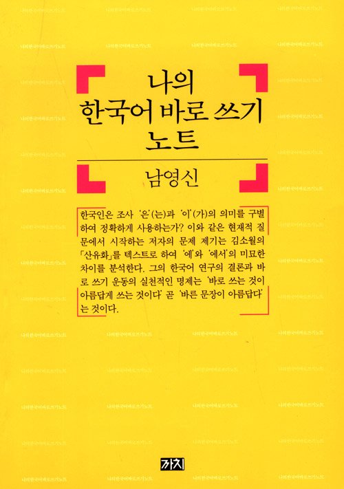

<!-- markdownlint-disable MD025 MD036 MD041 -->

제목 - 나의 한국어는 안녕하신가요?

# 한줄평

나의 한국어는 안녕하신가요? 얼마나 한국어를 잘 쓰고 있는지 확인해 보세요.

# 서평

> 나의 언어 한계는 나의 세계의 한계를 의미한다. - 루트비히 비트겐슈타인 <논리 철학 논고> -

__최근 회사에서 본 <데이터 중심 애플리케이션 설계> 책에서 저자가 인용한 문구다. 데이터를 표현하는 프로그램 언어에 따라 데이터 저장, 데이터 찾기 방법이 결정된다. 이를 바탕으로 구현한 애플리케이션이 데이터를 어떻게 활용할 지가 결정된다. 결국 데이터를 표현하는 언어가 애플리케이션의 구현 방식을 결정한다. 데이터를 내 생각, 프로그램 언어를 언어, 애플리케이션을 글(또는 말)이라고 단어를 교환해 보자. 내 생각을 표현하는 언어가 글을 쓰는 방식을 결정한다. 나는 한국어가 모국어이다. 말을 하거나 글을 쓰려면 한국어로 생각할 수 밖에 없다. 그렇다면 나는 한국어로 내 생각을 얼마나 잘 표현하고 있었나? <나의 한국어 바로쓰기 노트>를 읽으면 책이 나에게 이렇게 질문하는 것 같았다.
