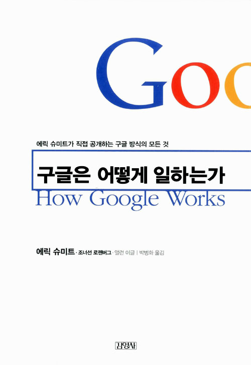

<!-- markdownlint-disable MD025 MD036 MD041 -->

# 한줄평

구글은 자율성, 공개, 인재, 데이터 근거, 혁신, 변화를 추구하며 일한다.

# 책소개

구글 CEO가 직접 쓴 책이기에 출판되었을 때부터 많은 관심을 받았던 책이다. 저자는 에릭 슈미츠, 조너선 로젠버그, 앨런 이글 님이다. 번역은 박병화님이다. 원서 출판이 2014년 9월이고 번역본이 10월인거 보니 동시출간으로 기획된 책이다. 책이 출간된 2014년에 기억나는 구글이 한 일들을 보면 구글 글래스 출시, 안드로이드 4.4 KitKat 출시(Nexus5, GalaxyS5)가 있었다.

간단하게 저자들이 구글에서 한 역할을 소개하면 에릭 슈미트(Eric Schmidit)님은 2001년부터 2011년까지 구글의 CEO로 재직했다. 조너선 로젠버그(Jonathan Rosenberg)님은 2002년부터 2011년까지 Senior Vice President of Products로 재직했다. 앨런 이글(Alan Eagle)님은 2007년부터 현재도 재직중이며 Director, Executive Communications이다.
(출처: [Eric Schmidt 위키피디아](https://en.wikipedia.org/wiki/Eric_Schmidt) / [Jonathan Rosenberg 위키피디아](https://en.wikipedia.org/wiki/Jonathan_Rosenberg_(technologist)) / [Alan Eagle 링크드인](https://www.linkedin.com/in/alaneagle/))

# 감상평

나에게는 이상적인 회사로 보이는 구글이 어떻게 일하는 지를 알 수 있는 책이었다. 경영자가 썼기 때문에 경영자 관점의 내용이 많지만 실무자 관점에서도 배울점들이 많은 책이다. 아직 나는 경영자 입장에 대해 생각하지 않아서 경영에 관한 부분들은 공감이 되기 보단 지금 내가 있는 회사와 비교가 될 뿐이었다. 비교할 때마다 아쉬운 느낌이 들었지만 구글의 일하는 방식 중에 내가 회사에서 할 수 있는 방법은 시도해 보려고 한다. 그래서 `결정: 합의의 진정한 의미` 챕터와 `소통: 뛰어난 라우터가 되어라` 챕터가 가장 공감이 잘 되는 챕터였다. 아래의 소챕터들은 내가 시도할 수 있는 것들이다.

* 기본 모드를 공개설정으로
* 사실대로 말하는 것이 안전하다
* 데이터로 결정하라
* 모든 회의에는 주인이 있어야 한다.
* 스스로를 평가하라
* 이메일의 지혜

`기본 모드를 공개설정으로`

정보 공개에 대한 규칙은 `기본 모드를 공개설정으로`이다. 모든 정보를 공유하게끔 기본 모드를 맞춰야 한다는 것이다.

* 이것이 대부분의 회사에서 행해지는 정보유통 방식이다. 고위급 경영진은 정보를 모은 다음 이중 어떤 것을 아래층에서 수고하는 사람들에게 나워줄 것인지 신중하게 결정한다. 이런 세계에서 정보는 통제와 권력의 수잔으로 축적된다. . . . "이런 풍토는 오로지 정보의 축적을 조장할 뿐"이라는 것이다.
* 오늘날 효율성을 극대화하는 지도자들은 정보를 쌓아두지 않고 유통시킨다. 리더십의 목표는 언제나 회사 전체의 정보의 유통을 극대화하는 것이다.

정보 공개라는 가치는 내가 살아가는 데 중요하게 실천하는 가치와도 같다. 책에서 "우리는 온갖 생생한 자료를 보유한 직원들을 신뢰하며 이들은 우리의 신뢰를 저버리지 않는다."를 보면 신뢰를 바탕으로 하고 있다는 것을 알 수 있다. 타인에 대한 신뢰도가 많이 떨어지는 우리 환경에서는 쉽사리 받아들이기 어려운 점이긴 하다. 하지만 내가 먼저 공개하고 신뢰를 준다면 불가능하지도 않다. 일단 내가 회사생활에서도 이점을 지키려 하고 있고 이렇게 공개함으로서 불필요한 소통을 줄이고 오해가 없어서 일이 훨씬 쉽게 진행된 경험이 많다. 회사뿐만 아니라 아내와도 거의 대부분의 정보와 생각을 공개하여 감춰서 생기는 다툼은 거의 없다.

여기서 지나칠 수 있는 부분이 모든 부분을 공개하지 않는 것과 원치 않는 정보가 누출되었을 때의 처리이다.

> "법이나 규정에 저촉되지 않는 소수의 정보를 제외하고 모든 것을 공유하라"라는 뜻이라는 걸 이해한다.

이 말은 당연한 것이다. 개인도 그렇고 기업도 그렇고 모든 걸 공개할 순 없다. 중요한 것은 기본 모드가 공개설정이라는 점이다.

> 우리가 원치 않은 정보 누출이 일어난 적은 있었지만, TGIF회의에서 누출된 것이 아니라는 것을 단언할 수 있다. 우리는 최선을 다해 누출의 진원지를 추적하며 성공률도 아주 높다. 이런 누출은 협력업체에세 빈번히 발생하며 만일 당사자가 구글러라면 즉시 해고 한다.

잘못된 정보 누출에 대해서는 단호하게 처리한다. 마냥 공개하는 것이 아닌 것임을 알 수 있다.

`사실대로 말하는 것이 안전하다`

* 개방과 투명성, 정직한 소통의 문화를 증진할 기회가 있다면 전부 붙잡아라.
* 에릭은 투명성에 접근하려는 우리의 방식을 '상승, 고백, 동의' 모형이라고 부른다.
  * 비행기 조종사가 위험에 빠졌을 때 가장 먼저 취하는 조치는 상승이다. 위험 상태에서 빠져 나오는 것이다.
  * 그런 다음 고백한다. 관제탑과 통신하면서 어떻게 혼란한 상황에 빠졌는지 설명하는 것이다.
  * 끝으로 동의란 관제탑에서 어떻게 하면 다음에 더 잘할지 일러주면 그대로 따른다는 뜻이다.
* 벤처사업에서 누군가 여러분에게 바쁜 소식이나 문제점을 가지고 올 때, 이들은 상승과 고백, 동의 모형의 과정을 밟는다. 이들은 상황을 파악하는데 많은 시간을 소비한다. 그러므로 여러분은 귀를 기울이고 도와주며 다음에는 이들이 매끄럽게 처리할 것이라고 신뢰함으로써 투명성을 보상해줄 필요가 있다.

개방, 투명성, 정직한 소통은 교과서적인 이야기 이라고 치부하는 사람들이 있지만 나는 이게 정말 중요하다고 생각한다. 이게 기본이며 이를 유지하려고 노력해야 한다고 생각한다.
이걸 회사와 가정 두 영역 모두에서 지키려 노력하는 한 사람으로서 이것이 가져오는 혜택은 편안함, 시원한 결정, 실패시에도 안정감이라고 할 수 있다. 이 것은 다시 개발, 투명성, 정직한 소통을 다시 하게 하는 힘을 주어 선의 선순환을 가지게 한다.

`데이터로 결정하라`

* 인터넷 시대에 변화무쌍하게 발전할 수 있는 것 중 하나는 사업에 대한 거의 모든 측면을 정량화할 수 있는 능력이다.
* 데이터 편향은 따분한 파워포인트 프레젠테이션의 권태를 없애주는 확실한 방법이다.
* 시각화는 보통 연관 정보가 같이 제시될 때 더 효과가 크다. 세부적인 내용 하나 하나가 연관성이 깊을수록 사실이 분명해지고 이해도 빨라진다.

이건 아직 내가 하지 못한 방법이다. 이 방법은 공부를 더 해봐야 겠다. 일단 통계관련 책을 보고 공부를 시작하자. 첫 걸음은 고영성 작가님 추천 책인 [벌거벗은 통계학](https://www.aladin.co.kr/shop/wproduct.aspx?ItemId=32536534)이다.

`모든 회의에는 주인이 있어야 한다.`

* 회의에는 한 사람의 의사결정권자,주체가 있어야 한다. 잘못되면 책임을 질 사람으로서, 회의 과정의 모든 간계마다 분명한 의사결정자가 반드시 있어야 한다.
* 동등한 두 집단 간의 회의는 종종 좋은 결과를 이끌어 내지 못할 때가 있다. 의사결정권자로서 조금이라도 더 직책이 높은 사람이 있어야 한다.
* 결정권자는 회의를 소집하고 안건이 바람직하다는 것을 확인해야 하며 목표를 세우고 참석자를 결정해야 한다.
* 적어도 24시간 전에 (가능하면) 참석자 간에 의제를 공유해야 한다.
* 회의를 마친 뒤, 결정권자는 (다른 사람은 안된다)회의의 결과를 요약하고 적어도 모든 참석자들에게-알 필요가 있는 사람도 포함해-48시간 내에 이행사항을 이메일로 알려야 한다.
* 비록 결론을 내리기 위한 회의가 아니라고 해도 -예컨대 정보를 공유하거나 해결책을 브레인스토밍하기 위한 회의- 분명한 주인이 있어야 한다.
* 회의는 언제가 인원이 적을수록 좋은 법이다.
* 시간을 지키는 것이 중요하다.

회사에서도 회의 그라운드 룰이라고 해서 위의 내용을 똑같이 공지하고 있다. 막상 시간이 없다는 것과 귀찮다는 핑계를 이를 지키지 않는데 이제는 몇가지라도 지켜봐야 겠다.
참석자를 줄이는 것, 회의 전에 의제를 공유하는 것, 시간을 지키는 것, 결과를 요약하고 공유하는 것은 꼭 지켜보자.

`스스로를 평가하라`

* 적어도 1년에 한 번은 자신의 실적에 대한 평가서를 작성하라.
* 그럼 다음 그것을 읽어보고 여러분이 자신을 위해 일했는지 확인하라.
* 그리고 그것을 사실상 당신을 위해 일하는 사람들과 공유하는 것이다.
* 여러분이 먼저 자신에 대한 비판을 시작한다면 다른 사람들도 자유로운 분위기에서 더 솔직해 질 것이다.

반성을 통해 자신의 목표에 얼마큰 가고 있는지 확인하고 다시 계획을 재조정한다. 반성하지 않으면 목표가 막연히 될 것이라는 우연에 기대는 것과 다를게 없다. '완벽한 공부법'에서의 데일리 리포트를 쓰면서 반성을 하게 되는데 확실히 내가 어디쯤 얼마큰 하고 있는지(메타인지)를 알 수 있어 다음 계획을 세워 낼 수 있다. 이렇게 하면 목표를 달성할 수 있겠다라는 믿음도 생긴다.

이 책에서 더 배운 점은 내가 반성한 것을 사람들과 공유하는 것이다. 이건 위의 투명성과 정직한 소통과도 이어지는데 이를 통해 더 증진된 소통을 이끌어 낼 수 있다.

`이메일의 지혜`

* 신속하게 답신을 보내라.
* 이메일을 작성할 때는 단어 하나하나가 중요하다.
  * 먼저 초안을 쓰고 그것을 검토한 다음 불필요한 말은 제거하라.
* 지속적으로 편지함을 비워라.
* 이메일은 LIFO(Last In First Out 후입선출, 나중에 들어간 데이터가 위에 있는 구조) 순서로 처리하는 것이 좋다.
* 필요한 정보가 담긴 메시지를 받으면 그것이 또 다른 누군가에게 유용할지 생각해보라.
* 숨은 참조를 활용할 때는 스스로 이유를 물어봐야 한다.
  * 투명한 문화에서는 비생산적인 것이고 잘못일 가능성이 있다. 이런 경우라면 수신자를 공개하거나 아예 보내지 마라.
* 요란하게 불만을 표하지 마라.
* 요구사항을 간단히 확인하는 방법이 있다. 확인이 필요한 조치사항을 누군가에게 메시지로 보낼 때는 자신의 주소로도 보낸 다음 '확인'이라는 표시를 하라.
* 훗날 검색할 것에 대비하라. 훗날 다시 필요할지도 모를 메시지를 받는다면 내용을 간단히 요약해 자신의 주소로 다시 보내라.

이건 굉장히 실용적인 팁들이다. 나는 운 좋게도 신입사원일 때 팀원으로서 이 팁들을 배웠었다. 그래서 이 부분은 나한테도 당연하게 생각되는 부분이다. 근데 이렇게 하지 않으면 일할 때 불편하다. 옆에서 보는 나도 불편하고 답답하다.

다른 주제들도 도움이 될 것이 많다. 다른 서평들에서도 얘기하지만 이 책은 경영자나 관리자가 본다면 많은 배울점을 알 수 있을 것이다. 또한 실무자가 윗 직책인 관리자나 경영자들이 생각해야 하는 바까지 알고 있다면 자신이 어떻게 대처해야 하는 지도 알 수 있기에 실무자들에게도 배울 점이 많은 책이다. 우리 회사는 왜 이렇지 않는지에 불만을 갖기보단 내가 있는 작은 팀에서 하나씩 적용해서 내 회사생활을 바꿔보는 것이 좋을 것 같다.