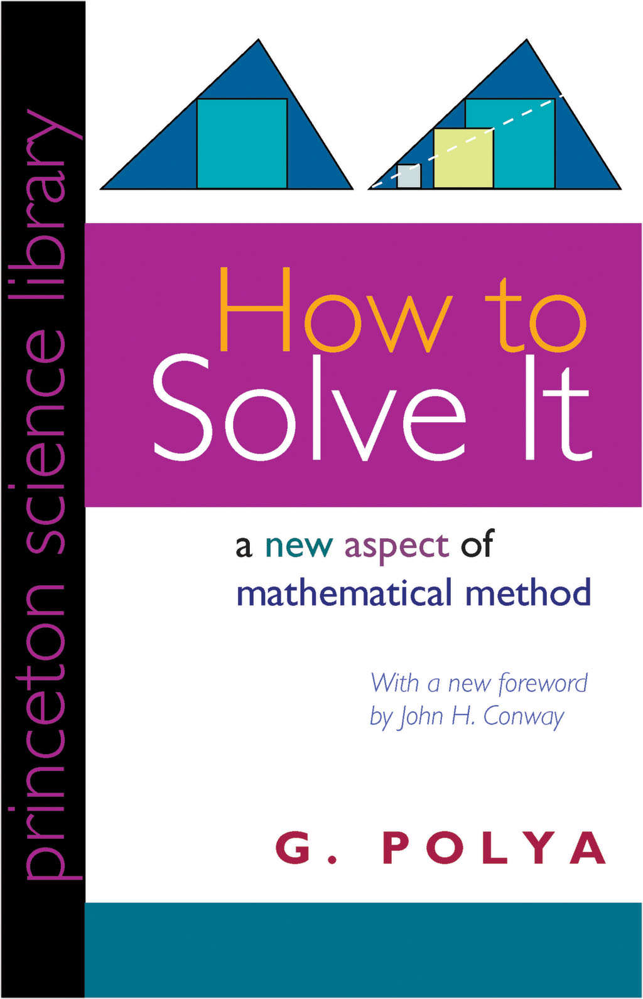

<!-- markdownlint-disable MD025 MD036 MD041 -->

# 한줄평

답은 맞는 것 같고, 정확한 듯 보인다. 그러나 어떻게 해서 그런 풀이를 생각해 낼 수 있는 것일까?

# 책 소개

"어떻게 문제를 풀 것인가?"는 포여 죄르지(헝가리어: Pólya György, 영어: George Pólya 조지 폴리아) 교수님이 쓴 책이다. 초판은 1945년[1]에 나왔다. 정말 오래된 책이다. 저자가 1887년생으로 1985년에 97세로 돌아가셨다. (거의 내 고조할아버지 뻘 정도 되신다.) 세계적인 수학자이며 2차 세계대전 중 미국으로 이민을 가서 스탠퍼드 대학교의 교수를 지내셨다. 전쟁으로 엄청난 혼란의 시기에 이런 책이 쓰여졌다는 것이 놀랍다. 책 내용에서는 전혀 옛것이라는 느낌이 없다. 고조할아버지가 나에게 이야기한다고 생각하고 읽으면 친숙하게 읽을 수 있을 것이다. 역자는 우정호 교수님이다. 현재 서울대학교 수학 교육과 명예교수님이다.

* [1] 출처: <https://en.wikipedia.org/wiki/How_to_Solve_It>
* 포여 죄르지 교수님이 강의한 동영상: [Polya explains the problem solving technique](https://www.youtube.com/watch?v=h0gbw-Ur_do)

# 감상평

[개발자 한 달에 책 한권 읽기모임](https://www.facebook.com/dev.reader)에서 2019년 4월에 보기로 한 책이다. 교과서 같은 느낌이라 평소같았으면 보지 않았을 책이다. 책 내용의 문장도 교과서 느낌이라 평소에 읽었던 책과는 다른 어색한 느낌이있다. 하지만 읽다 보면 익숙해 진다. 이런 이야기로 평을 시작하는 것은 책 초반부는 이해하기가 어려웠기 때문이다. 특히 한자로 된 용어가 자주 나온다. 요즘처럼 한자를 거의 쓰지 않는 나에게는 뜻을 몰라 내용을 이해하기 어려웠다. 모르는 우리 단어들은 책을 읽을 때 매번 찾아보지만 이번 책은 자주 찾아보게 되어 책에 따로 정리 해 놓았다.

그래도 용어를 찾으면서 읽으면 집중이 흩트러져서 내가 해석만 쉬운 뜻으로 용어 밑에 써 가면서 읽었다. 용어 정리를 하면 확실히 책이 수월하게 읽힌다. 내가 몰랐던 용어는 아래에 정리하였다.

먼저 이 책은 중.고등학교에서 배울 때 있던 수학책이 아니다. 수학에 대한 거부감을 가진 사람이 많아 이 책을 꺼려할 까봐 먼저 밝힌다. 저자가 수학교사와 수학을 배우는 학생을 대상으로 책을 썼다. 하지만 수학 문제 풀이에 초점이 맞혀져 있지 않고 일반적으로 우리가 만날 수 있는 문제에도 적용할 수 있게 평이하게 설명되어 있다.

"어떻게 문제를 풀 것인가?"는 문제를 해결할 때 책에서 제시하는 질문을 생각해보고 질문에 답하다보면 질문-답의 사고의 흐름이 답(풀이)에 도달할 수 있게 해준다는 것을 설명한 책이다. 나는 가끔 "다른 사람들이 어떤 생각의 과정을 거쳐서 문제를 풀었을까?"라는 생각을 한다. 그 당시 나는 문제를 해결하지 못했다. 해답이 궁금하긴 하지만 남이 풀어버린 해답에는 관심이 없다. 내가 직접 문제를 풀어야 개운하다. 그래서 그들이 어떤 생각의 흐름을 거쳐 해답에 도달했는지가 궁금하다. 답을 베끼는 행동은 문제가 되지만 과정을 따라하는 것은 문제가 되지 않는다. 오히려 답을 내꺼로 만드는 방법이 된다.

이 책에서 알려주는 방법이 이러한 문제 해결을 위한 질문들을 설명해 준다. 내가 알고 싶었던 내용이다. 도입부의 책 배경에 정말 공감하면서 보게 되었다.

> "그렇다. 해답은 맞는 것 같고, 정확한 듯 보인다. 그러나 어떻게 해서 그러한 풀이를 고안할 수 있는 것일까? 그렇다. 이 실험은 잘 된 것 같고, 사실과 일치하는 듯하다. 그러나 사람은 어떻게 해서 그러한 사실을 발견할 수 있게 되는 것일까? 그리고 나라면 어떻게 해야 그러한 것들을 스스로 발견하거나 발명할 수 있을 것인가?

이 지문에 마음이 움직인다면 이 책이 도움이 될 것이다.

# 내가 몰랐던 용어 정리

**발문**

교육학 용어. 교사가 학습자의 학습활동을 촉진시키기 위해서 물어보는 문제제기를 의미.
_
(-> 나만의 해석: 문제제기)

**권고**

남에게 무엇을 하도록 권함
(-> 나만의 해석: 권장)

**미지**

어떠한 사실 따위를 아직 알지 못함.
(-> 나만의 해석: 아직 모르는 것)

**미지인 것은 무엇인가?**

(-> 나만의 해석: 아직 모르는 것은?)

**교과**

가르치는 과목. 학교에서 학생이 배울 내용을 체계적으로 짜 놓은 일정한 분야.
(-> 나만의 해석: 과목)

**전연**

주로 부정어와 함께 스여, '조금도', '아주', '완전히'라는 뜻을 나타내는 말.
(-> 나만의 해석: 아주)

**발견술**

휴리스틱(Heuristics)이란 주로 심리학, 경제학, 인공지능 분야에서 사용하는 의사결정 기법 중 하나입니다.
생소하거나 어려운 문제 상황을 직면했을 때 '경험적 지식'을 바탕으로 그것을 어떻게 해결할 지 생각하는 전략을 세워 문제 해결의 지름길을 제공합니다.
어떤 사안이나 상황을 엄밀하게 분석하기보다 제한된 근거로 직관적인 결론을 도출해내는 방법입니다.
(-> 나만의 해석: 때려 맞추기)

**잠정적**

우선 임시로 정한 것.
(-> 나만의 해석: 임시적)

**개연적**

반드시 그렇다고 할수 없으나 대개 그러하리라고 생각되는 것.
(-> 나만의 해석: 그럴듯한 것)

**함의한다**

말이나 글 속에 담고있다.
(-> 나만의 해석: 담고있다)

**가역적**

물질의 상태가 한 번 바뀐 다음에 다시 본디의 상태로 돌아갈 수 있는 것
(-> 나만의 해석: 되돌릴수 있는 것)

# 내용 갈무리

**발문과 권고들을 간편하게 갈라 묶기 위하여, 네 가지 사고 단계를 구분**

* 첫째, 우리는 문제를 `이해`하여야 한다. 곧, 구하는 것이 무엇인지를 분명히 알아야 한다.
* 둘째, 우리는 여러 가지 사항들이 어떻게 관련되어 있는지, 또한 미지인 것이 자료와 어떻게 연결되어 있는지를 알아내어 풀이에 대한 착상을 하고 `계획`을 세워야 한다.
* 셋째, 우리의 계획을 `실행`하여야 한다.
* 넷째, 완성된 풀이를 `뒤돌아보고` 다시 검토하며 논의하여야 한다.

(-> 많은 사전식 질문들을 묶어서 기억하기 쉽게 하였다. 네 가지 사고 단계를 책의 큰 축으로 생각하자.)

(-> 이해->계획->실행->반성. 내가 문제를 풀때 첫 단계인 이해를 제대로 하지 않고 다음 단계로 넘어간다.
최근의 POCU 아카데미의 C++수업 과제에서 이해를 제대로 하지 않은 문제로 고생했다. 문제에서 제시된 조건을 제대로 읽지 않고 프로그램을 구현했었다. 결국 조건을 테스트하는 과정에서 잘못이 드러나게 되었다.
그런데 문제를 제대로 이해하지 못했기 때문에 왜 테스트에서 내 코드가 잘못되었는지를 인지하지 못하고 헛걸음을 한다. 시작이 비뚤어지면 나아가면서 더 크게 벌어진다
첫 단계 이해가 중요하다. 일단 시작은 문제 이해부터 잘 해보도록 노력해 보자.)

## 교실에서

교사와 학생에 대해 조언하는 챕터이다. 여기의 발문(문제제기)를 어떻게 활용할 것인지 어떤 도움이 될 지를 설명하였다.
저자의 교육관도 엿볼 수 있으며 인간적인 면을 볼 수 있어 다른 챕터보다는 읽기 쉬운 챕터다.

* 교사는 학생으로 하여금 "적절한 몫의 활동"을 할 수 있도록, 너무 지나치지도 모자라지도 않게 도와 주어야 할 것이다. 학생이 그다지 유능하지 않은 경우라도 교사는 학생에게 적어도 독자적인 활동을 하고 있다는 생각이 들도록 해 주어야 할 것이다. 그러기 위해서는 교사는 학생을 신중하게, "조심성 있게" 도와 주어야 한다.
* (-> 학생의 자율성을 지키라는 것이다. 이 가치는 육아할 때도 자녀에게도 똑같이 적용해야 한다. 교육에 대해서는 교사-학생 관계와 부모-자식 관계가 비슷해서 저자의 교육관으로부터 배울 것이 있다.)
* 이러한 발문 목적은 학생 관심이 미지인 것에 모이는 데 있다.
* **"미지인 것은 무엇인가?", "자료는 무엇인가?", "조건은 무엇인가?"**와 같은 이들 질문은 일반적으로 적용될 수 있는 것으로 어떠한 종류의 문제를 다둘 때에도 매우 효과적으로 제기될 수 있다.
* 중대한 문제이건 단순한 수수께끼이건 관계없이 이들 발문은 의미가 있으며, 문제를 푸는 데 도움이 될 것이다.
* **교사가 학생에게 여기의 발문이가 권고를 할 때 의도하는 목적**
* ...첫째는 학생을 도와 당면한 문제를 풀게 하려는 것
* ...둘째는 학생의 능력을 개발하여 장래 문제를 스스로 풀 수 있게끔 하려는 것
* 문제 해결이란, 말하자면 수영과 같은 실제적 기능이다. 어떠한 실제적 기능도 모방과 연습에 의해서 얻어진다.
* 여러분은 문제를 풀려고 애쓰면서 다른 사람들이 문제를 풀 때 하는 것을 관찰하고 모방하여야만 하며, 그렇게 해 봄으로써 마침내는 문제를 해결하는 방법을 배우게 된다.
* 교실에서 교사가 문제를 풀어 보일 때에는 그의 생각을 다소 극적으로 제시해야 하며, 그가 학생을 도울 때 사용하는 것과 똑같은 발문을 자신에게 해야 한다.
* (-> 중간 사고과정을 학생들에게 보여주라.)
* `문제에 대한 이해`
* 무엇보다도 문제를 설명하는 언어적 진술이 이해되어야 한다.
* 교사는 학생에게 문장을 반복해서 읽도록 요구하여, 학생들이 문제를 유창하게 진술할 수 있도록 해야 한다.
* `계획의 작성`
* 학생들의 입장을 이해하려면, 교사 자신의 문제를 풀 때 스스로 겪은 곤란과 성공에 대한 경험을 생각해 보아야 한다.
* 좋은 생각이란 과거의 경험과 이전에 얻은 지식을 바탕으로 한 것이다.
* 수학 문제를 해결하는 데 필요한 재료란, 전에 풀어 본 문제나 전에 증명한 정리 등과 같은 이전에 얻은 수학 지식들 중에 어떤 것들과 관련된 내용들이다.
* `계획의 실행`
* 계획을 세우는 것, 풀이를 위한 착상을 하는 것은 쉬운 일이 아니다. 이를 달성하려면 많은 것이 요구된다. 즉, 앞에서 획득한 지식, 훌륭한 사고 습관, 목적을 향한 집중력 등이 요구되며 여기에 또 한 가지를 더 든다면 행운이 따라야 한다.
* 여기에 비해 계획을 실행하는 것을 훨씬 쉽다. **여기서 요구되는 것은 인내심이다.**
* 모든 것이 아주 명확해지고 오류가 숨겨져 있을 수도 있는 모호한 구석이 남아 있지 않을 때까지 인내를 가지고 세부적인 것을 차례차례 점검해야 한다.
* `반성`
* 상당히 우수한 학생이라 할지라도 문제의 해답을 얻고 그 과정을 정연히 쓰고 나면 교재를 덮어버리고 무언가 딴 것을 찾게 마련이다. 그 결과 중요하고도 교훈적인 사고 단계를 빠뜨리는 것이다.
* 완성된 풀이를 검토하고 그 결과와 그 결과에 이르게 된 과정을 재고하고 재검사함으로써 획득한 지식을 견고하게 하고 문제를 해결하는 능력을 발달시킬 수 있을 것이다.
* 교사의 가장 중요한 첫째 가는 의무 중의 하나는 여러 가지 수학적 문제가 서로 거의 관련이 없으며 수학 밖의 것과 전혀 관련이 없다는 인상을 주지 않는 것이다.

## 어떻게 문제를 풀 것인가? 전체 요약

저자가 친절하게 전체 요약을 해 두었다. 이 요약이 책의 큰 그림이고 지도이다. 주요한 4 단계는 내가 더 요약할 거리가 없다. 저자한 요약을 그대로 인용한다.
책에서도 요약 이후 대부분은 발문과 권고를 사전식으로 나열하여 설명한다. 전체 그림을 미리 알고 세부적인 질문을 봐야 왜 이런 질문을 하는지 알 수 있다.

`1. 문제에 대한 이해`

* **"미지인 것은 무엇인가? 자료는 무엇인가, 조건은 무엇인가?"**
* 조건은 만족될 수 있는가? 조건은 미지인 것을 결정하기에 충분한가, 또는 불충분한가, 또는 과다한가, 또는 모순되는가?
* 그림을 그려 보아라. 적절한 기호를 붙여라
* 조건을 여러 부분으로 분해하라. 그것을 써서 나타낼 수 있는가?

`2. 계획의 작성`

* 전에 그 문제를 본 일이 있는가? 그렇지 않으면 약간 다른 형태로 된 같은 문제를 본 일이 있는가?
* **"관련된 문제를 알고 있는가?"** 유용하게 쓰일 수 있을 듯한 어떤 정리를 알고 있는가?
* **"미지인 것을 살펴보아라!"** 친숙한 문제 중 미지인 것이 같거나 유사한 문제를 생각해 보아라
* **"관련된 문제로 전에 풀어 본 일이 있는 문제가 있구나. 그것을 활용할 수 있을까?"**
* ...그 결과를 활용할 수 있을까? 그 방법을 활용할 수 있을까? 어떤 보조 요소를 도입하면 그것을 활용할 수 있을까?
* 문제를 달리 진술할 수 있을까? 좀 더 다르게 진술할 수 있을까? 정의로 되돌아가 보자.
* 만일 제기된 문제를 풀 수 없다면, 먼저 어느 정도 그와 관련된 문제를 풀어 보아라.
* ...보다 접근하기 쉬운 관련된 문제를 생각해 낼 수 있는가? 보다 일반적인 문제는? 보다 특수한 문제는? 유사한 문제는?
* ...문제를 부분적으로 풀 수 있는가?
* ...조건 가운데 일부분만 남기고 다른 것은 버려보아라. 그랬을 때 미지인 것은 어느 정도까지 정해지는가?
* ...자료로부터 무언가 유용한 것을 이끌어 낼 수 있을까?
* ...미지인 것을 결정하는 데 적절한 다른 자료를 생각해 볼 수 있을까?
* ...새로운 미지인 것과 새로운 자료가 서로 보다 더 가깝게 되도록 하기 위해서 미지인 것이나 자료 또는 필요하다면 두 가지 다 변형할 수 있을까?
* 자료는 모두 사용했는가? 조건은 모두 사용했는가? 문제에 포함된 핵심적인 개념은 모두 고려했는가?

`3. 계획의 실행`

* 풀이 계획을 실행하고, **"매 단계를 점검하라"**
* ...각 단계가 올바른지 명확히 알 수 있는가? 그것이 옳다는 것을 증명할 수 있는가?

`4. 반성`

* **"결과를 점검"**할 수 있는가? 논증과정을 점검할 수 있는가?
* 결과를 다른 방법으로 이끌어 낼 수 있는가? 그것을 한 눈에 알 수 있는가?
* 결과나 방법을 어떤 다른 문제에 활용할 수 있는가?