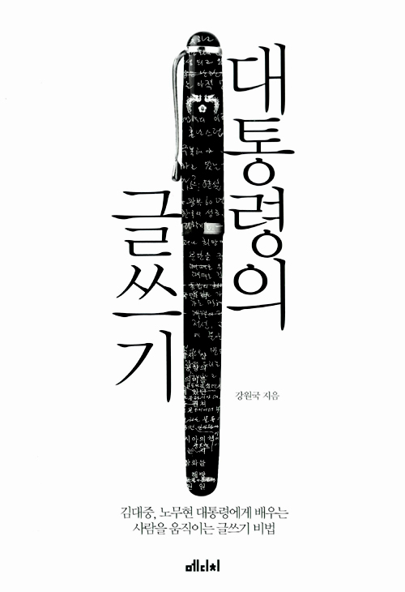

<!-- markdownlint-disable MD025 MD036 MD041 -->

# 한줄평

글쓰는 방법에서 두 대통령을 만나다

# 책소개

`대통령의 글쓰기`는 강원국님이 2014년 2월에 쓴 글쓰기책이다. 부제는 김대중, 노무현 대통령에게 배우는 사람을 움직이는 글쓰기 비법이다. 저자는 김대중 대통령 때에는 연설비서관실 행정관으로 노무현 대통령 때는 연설비서관으로 일했다. 연설문으로 그들과 소통하면서 대통령이 어떻게 자신을 뜻을 밝히는 지를 배웠다고 한다.

# 감상평

이 책은 강원국 작가가 김대중 대통령과 노무현 대통령을 그리워 하는 마음을 쓴 글이다. 글쓰기 방법이라는 소재를 가지고 두 대통령과의 추억을 되돌아본 것이다. 사람을 그리워할 때 이런 방법으로도 표현을 할 수 있다는 것에 참신하다고 느꼈다. 두 분의 집권했을 때 나는 대학생이었기에 뉴스로 자주 두 대통령을 봤었다. 동시에게 같이 있었기 때문에 그런지 책에 실린 연설문이 글로만 보이지 않고 실제 말하는 것처럼 느껴졌다. 노무현 대통령은 처음으로 내가 참여한 대통령선거였으며 더군다나 내가 선택한 사람이 대통령이 되어서인지 더 각별하다. 책에서 감정을 많이 느껴져서 책에 대한 평가전에 두 분에 대한 그리움을 쓰게 된다.

유투브에 두 분의 연설이 올라와 있으니 한 번씩 보면 책을 더 생동감있게 읽을 수 있다.

책을 볼 때 전체적인 책의 구성을 보기 위해 목차를 먼저 본다. 이번 책의 목차를 보면 제목이 대부분 대통령과의 일화를 나타낸다. 목차를 보고 어떤 구성인지를 알기는 어려웠다.  

김대중 대통령과 노무현 대통령이 더 알 수 있었다.

- 연설문을 준비하는 과정에서 두 대통령의 자신의 삶에 기준과 삶을 대하는 태도를 알 수 있었다.
- 저자가 두 대통령을 그리워하면 쓴 글이라 애틋한 감정을 느낄 수 있었다. 각 주제들의 제목이 일화를 나타낸다. 부제가 끌쓰는 방법이다.

짧은 말의 위력

쉽게 쓰자

명료하게 써라

진정성으로 승부하라

용기가 필요하다