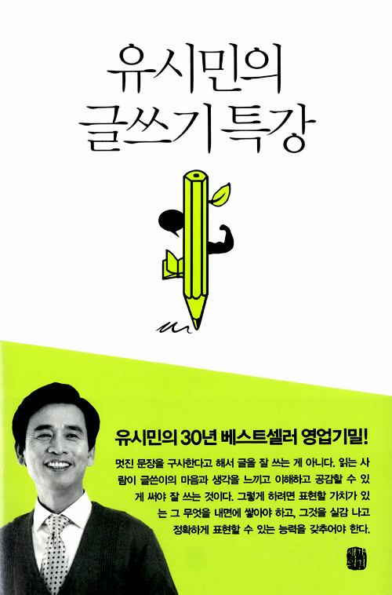

<!-- markdownlint-disable MD025 MD036 MD041 -->

# 한줄평

논리적인 좋은 글을 쓰고 싶은가? 좋은 책을 읽고 매일 조금씩이라고 글을 써라. 더 중요한 한가지가 더 있다. 합리적으로 생각하고 떳떳하게 살아라.

# 책소개

"유시민의 글쓰기 특강" 제목에서 나와 있듯이 유시민님이 쓴 책이다. 2015년에 발행되었으며 역설적으로 당시 대통령이 말을 못하는 것 때문인지 논리적으로 말하기, 글쓰기가 더 주목받았던 시기였다. 그래서 인지 "유시민의 글쓰기 특강"을 시작으로 글쓰기와 관련된 책을 연속으로 4권을 썼다. 그 책은 "유시민의 글쓰기 특강" (생각의길, 2015), "유시민의 논술 특강" (생각의길, 2015), "표현의 기술" (생각의길, 2016), "유시민의 공감필법" (창비, 2016) 이렇게 이다.

유시민님은 출판사 편집사원, 신문사 해외 통신원, 공공기관 직원, 신문 칼럼니스트, 방송 토론 진행자, 국회의원, 장관, 작가까지 여러 직업을 거쳤다. 직업들이 모두 논리적인 글쓰기와 관련되어 있다. 논리적 글쓰기는 재능이 아니라 훈련이라는 말을 몸소 실천한 것 같다.

아래 영상은 내가 이 책을 읽게 된 동기를 준 영상이다. 서울대에서 발표한 글쓰기 특강으로 책을 출간한 이후에 한 강연이라 책을 이해하는데 도움이 많이 되는 영상이다.

[유시민의 글쓰기 서울대 특강 영상](https://youtu.be/EyRmMFCzZak)

# 감상평

책에 대한 감상을 적기 전에 난 유시민 작가님의 뒤늦은 팬이다. 책과 강연을 들으면서 작가님한테서 많이 배운다. 작가님보다는 선생님으로 부르고 싶지만 작가님 성격으로 봐선 "내가 해주는게 없는데 무슨 선생님이냐"하고 대꾸하실꺼 같아 작가님으로 부른다. 그래도 마음속에선 선생님이다.

이번까지 글쓰기 특강을 2번 읽었다. 첫 번째 독서는 책을 산 2017년 여름 쯤이다. 회사에서 주위 사람들과 알고 있는 지식을 나누기 위해 글을 자주 썼다. 쓸 때마 글이 너무 단조롭고 앞뒤가 잘 맞지 않아 글쓰는 데에 답답함을 많이 느꼈다. 마침 그 때 유투브에서 작가님의 글쓰기 서울대 특강이 추천되었고 영상을 보자 마자 책을 사서 읽었다. 처음 읽고 나서는 단문쓰기와 일본말, 중국말, 외래어로 오염된 우리말에 대한 내용이 흥미로웠다. 이후 회사에서 메일과 기술 블로그를 적을 때 도움이 되었다. 하지만 지속적인 글쓰기르 하지 않아 실력이 별로 늘지 않은 채 머물렀다.

두 번째 독서는 체인지그라운드에서 주최하는 씽큐베이션 독서모임에 참여할 수 있게 되면서 읽게 되었다. 작년부터 제대로된 독서를 위해 독서와 서평을 매달 꾸준히 하니 좋은 글을 쓰고 싶다는 욕심이 생겼고 독서모임으로 다시 이 책을 읽게 되었다.

재독을 하니 분명 처음에 놓친 부분들을 알 수 있었다. 특히 "글쓰기가 두려운 그대에게"라는 서문에서 이야기한 초보 운전자 설명이 나를 안심시켰다.

> 무엇이든 잘 모르면 겁이 난다. 처음에 초보가 아니었던 운전자는 없다. 솜씨 좋은 운전자들도 교습소에서 처음 핸들을 잡았을 때 느꼈던 감점, 첫 도로 연수를 나갔을 때 들었던 두려움을 기억할 것이다. 사람들은 원고지나 컴퓨터 모니터 앞에서도 비슷한 감정을 느낀다. 나는 그런 분들에게 말하고 싶다.\
"두려움을 이기는 가장 좋은 방법은 글쓰기에 익숙해지는 것입니다. 자동차 페달과 변속기 손잡이가  그런 것처럼, 자꾸 글을 쓰다보면 그대에게도 컴퓨터 키보드나 볼펜이 손가락처럼 자연스러워지는 순간이 찾아올 겁니다."

이번 독서모임에는 매주 한 권의 책을 읽고 서평을 올려야 한다는 규칙이 있다. 이 환경설정이 글쓰기가 익숙해지는데 큰 기반이 될 것 같다. 독서모임 첫 책으로 글쓰기 특강인 것은 정말 좋은 선택이다. 모임 목표 12주 동안 읽고 서평을 쓸 때 작가님이 제안한 3가지 규칙을 지키면서 서평을 써 봐야 겠다.

# 내용 갈무리
