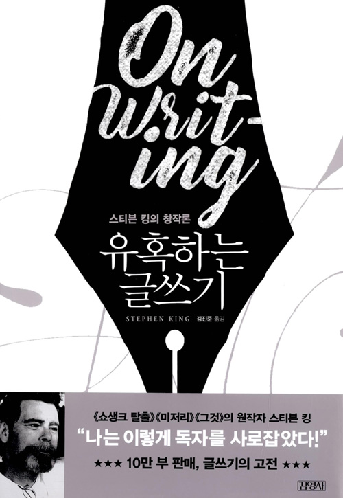

<!-- markdownlint-disable MD025 MD036 MD041 MD026 -->

# 제목

`유혹하는 글쓰기` 핵심을 명료하게 표현하고 군더더기를 빼자.

# 서평 들어가기전

이번 서평은 이전과 다르다. "유혹하는 글쓰기"에서 좋았던 내용을 쓰는게 아니다. 3권의 글쓰기 책(유시민의 글쓰기 특강, 대통령의 글쓰기, 유혹하는 글쓰기)을 통해 자신의 글쓰기를 돌아보고 장.단점을 찾아 발전할 방법을 생각하는 것이다. 막상 쓰려고 하니 좋았던 것과 나빴던 것이 떠오르지 않는다. 생각만 하지 말고 내 글에서 직접 찾기로 했다. 세 책의 요약을 보고 좋은 글쓰기 조건을 나열했다. 이 조건들을 몇번이나 만족,불만족 했는지 내 모든 서평을 읽으면서 평가했다. 내 글에 장단점이 드러나 있던 것이다. 이제 내가 찾은 단점, 장점, 극복방안을 살펴보자.

# 글쓰기에서 내가 부족한 건 무얼까? 그리고 어떻게 극복할까?

* 군더더기가 많다.
* 복문이 많다.

불만족 1위, 2위다. 왜 부족했는지 핑계대지 말고 담담하게 검토하자. 아래는 군더더기 문단 중에 가장 마음에 안 드는 것 2개 가져왔다.

> 개발자 한 달에 책 한권 읽기모임 에서 2019년 4월에 보기로 한 책이다. 교과서 같은 느낌이라 평소같았으면 보지 않았을 책이다. 책 내용의 문장도 교과서 느낌이라 평소에 읽었던 책과는 다른 어색한 느낌이있다. 하지만 읽다 보면 익숙해 진다. 이런 이야기로 평을 시작하는 것은 책 초반부는 이해하기가 어려웠기 때문이다. 특히 한자로 된 용어가 자주 나온다. 요즘처럼 한자를 거의 쓰지 않는 나에게는 뜻을 몰라 내용을 이해하기 어려웠다. 모르는 우리 단어들은 책을 읽을 때 매번 찾아보지만 이번 책은 자주 찾아보게 되어 책에 따로 정리 해 놓았다. -- <어떻게 문제를 풀 것인가?> 서평 --
>
> 책에 대한 감상을 적기 전에 난 유시민 작가님의 뒤늦은 팬이다. 책과 강연을 들으면서 작가님한테서 많이 배운다. 작가님보다는 선생님으로 부르고 싶지만 작가님 성격으로 봐선 "내가 해주는 게 없는데 무슨 선생님이냐"하고 대꾸하실 거 같아 작가님으로 부른다. 그래도 마음속에선 선생님이다. -- <유시민의 글쓰기 특강> 서평 --

다시 읽어보니 내가 무슨 말을 하려 했는지 정리할 수 있었다. 첫 번째 문단은 "이 책은 한자로 된 단어가 많아 이해하기가 어려워서 용어정리를 했다"이다. 읽기 힘들었다는 하소연으로 글이 길어졌다. 두 번째 문단은 "내가 유시민 작가님 팬이다"라는게 요지다. 내가 팬이라는 것만 알리면 된 것을 쓸데없는 선생님 설명이 들어갔다. 남들이 저런거까지 알고 싶어할까라는 의문이 드니 불필요하다는 판단을 했다. 더군다나 위 두 문단은 글 도입부에 위치한다. 입구에서부터 손님이 도망가게 된거다.

왜 말할 핵심을 못 찾고 중언부언하는가? 시작부터 살펴본다. 글 쓸 당시 마음을 살펴보면 평가하기보다 글을 쓰려는 마음이 앞섰다. 그래서 이말저말 횡설수설하게 된거다. 이 경우에 대해 <대통령의 글쓰기>에서 조언한 것이 있다. 가급적 한 가지 주제만 다뤄라. 감동을 주려고 하지 말고 조바심을 버려라. 반드시 논리적일 필요도 없다. 먼저 욕심을 
버리고 정말 하고 싶은 말이 뭔지를 찾는 것부터 하자.

. 감동을 주려왜 하지 말자. 조바심을 버리자. 반드시 글 쓸때 당시로 돌아가서 나를 내려다 보자. 떤 마음이였는지 생각해보니  서평쓰기를 시작할 때를 돌이켜 보면 알 수 있다. 자.자루.이이 앞섰기 때문이다.복하는 방법도 <대통에서의내 상황을 설명해준다

> "어떻게 문제를 풀 것인가?"는 문제를 해결할 때 책에서 제시하는 질문을 생각해보고 질문에 답하다보면 질문-답의 사고의 흐름이 답(풀이)에 도달할 수 있게 해준다는 것을 설명한 책이다. -- <어떻게 문제를 풀 것인가?> 서평 --
>
> 먼저 이 책을 읽게 된 것은 객체지향에 대해 좀 더 알고 싶다라는 마음에 어떤 책이 좋을 지 찾다가 참여 중인 개발자 독서 모임(개발자 한 달에 책 한 권 읽기)에서 토론하고 추천한 책이라 보게 되었다. 그동안은 객체지향을 알려하면 매번 클래스를 가지고 캡슐화, 상속, 다형성을 설명하는 게 대부분이였다. 특정 언어의 문법 위주와 자동차에 대한 객체 비유만으로는 구현할 때 내가 만들어야 하는 상황에서 객체를 어떻게 찾고 구성해야 하는지를 알 수 가 없었다. 대학수업과 박영만 학원 SE과정에서 배웠던 바에서도 프로젝트에 대한 문제 정의, 요구사항을 정리한 다음 거기서 동적인 부분과 정적인 부분(대개 명사 단어와 행위 임)을 추출해서 클래스를 하나씩 만들고 관계를 연결하는 것이 설명이였다. 하지만 문제 정의와 요구사항에서 막연히 뽑아내는게 쉽지 않았다. -- <객체지향의 사실과 오해> 서평 --

문장이 길게 이어져 장황한 느낌이다. 이게 글을 답답하게 만든다. 속도감도 떨어뜨린다. 첫 문단을 고쳐본다. "어떻게 문제를 풀 것인가?"는 질문,답의 사고 흐름을 도달할 수 있게 도와준다. 저자는 먼저 제시하는 해결방안은 저자가 만든 문제제기 질문에 답을 생각하면 사고 흐름이 이어져 풀이에 도달한다는 것이다.

# 글쓰기에서 나의 강점은 무얼까?

아는 것을 쓰자. 진정성을 담자
평이하고 직설적인 표현을 하자.

# 어떻게 단점을 극복하고 장점을 발전시킬까?
