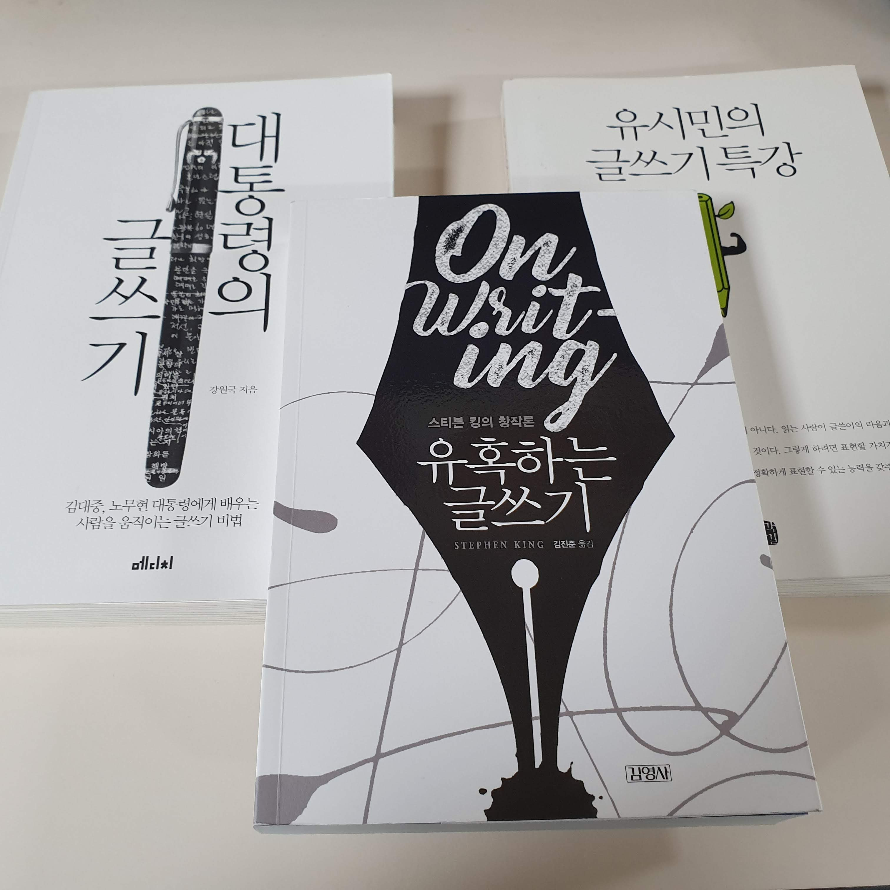

<!-- markdownlint-disable MD025 MD036 MD041 MD026 -->

# 제목

`유혹하는 글쓰기` 명료하게 핵심만 표현하고 군더더기를 빼자.

# 서평 들어가기전

이번 서평은 이전과 다르다. "유혹하는 글쓰기"에서 좋았던 내용을 쓰는게 아니다. 3권의 글쓰기 책(유시민의 글쓰기 특강, 대통령의 글쓰기, 유혹하는 글쓰기)을 통해 자신의 글쓰기를 돌아보고 장.단점을 찾아 발전할 방법을 생각하는 것이다. 막상 생각만으론 장점, 단점을 떠올릴 수 없없다. 그래서 생각 하지 말고 내 글에서 직접 찾기로 했다. 먼저 평가할 기준을 찾기 위해 3권의 요약을 보고 나열했다. 그 다음 내가 쓴 9편 서평을 기준들로 하나하나 평가했다. 당연한 얘기지만 내 글에 장단점이 담겨 있었다.

# 글쓰기에서 내가 부족한 건 무얼까? 그리고 어떻게 극복할까?

기준 불만족 1위, 2위다.

* 군더더기가 많다.
* 복문이 많다.

군더더기 부터 살펴본다. 아래는 군더더기 문단 중에 가장 마음에 안 드는 것 2개를 가져왔다.

> 개발자 한 달에 책 한권 읽기모임 에서 2019년 4월에 보기로 한 책이다. 교과서 같은 느낌이라 평소같았으면 보지 않았을 책이다. 책 내용의 문장도 교과서 느낌이라 평소에 읽었던 책과는 다른 어색한 느낌이있다. 하지만 읽다 보면 익숙해 진다. 이런 이야기로 평을 시작하는 것은 책 초반부는 이해하기가 어려웠기 때문이다. 특히 한자로 된 용어가 자주 나온다. 요즘처럼 한자를 거의 쓰지 않는 나에게는 뜻을 몰라 내용을 이해하기 어려웠다. 모르는 우리 단어들은 책을 읽을 때 매번 찾아보지만 이번 책은 자주 찾아보게 되어 책에 따로 정리 해 놓았다. -- <어떻게 문제를 풀 것인가?> 서평 --
>
> 책에 대한 감상을 적기 전에 난 유시민 작가님의 뒤늦은 팬이다. 책과 강연을 들으면서 작가님한테서 많이 배운다. 작가님보다는 선생님으로 부르고 싶지만 작가님 성격으로 봐선 "내가 해주는 게 없는데 무슨 선생님이냐"하고 대꾸하실 거 같아 작가님으로 부른다. 그래도 마음속에선 선생님이다. -- <유시민의 글쓰기 특강> 서평 --

나조차도 읽어보니 무슨 말을 하려 했는지 정리가 안 됐다. 사실 첫 번째 문단은 "이 책은 한자로 된 단어가 많아 이해하기가 어려워서 용어정리를 했다"가 요점이다. 읽기 힘들었다는 하소연으로 글이 길어졌다. 두 번째 문단은 "내가 유시민 작가님 팬이다"라는게 요지다. 내가 팬이라는 것만 알리면 된 것을 쓸데없는 선생님 설명이 들어갔다. 남들이 저런거까지 알고 싶어할까라는 의문이 든다. 더군다나 위 두 문단은 글 도입부에 위치한다. 입구에서부터 손님이 도망갈 판이다.

왜 말할 핵심을 못 찾고 중언부언 했을까? 과거 글쓰기 시작할 때부터 살펴본다. 글 쓸 당시 마음을 보면 글 평가보다 글을 써야 한다는 마음이 앞섰다. 그래서 주제가 정해지지 않았고 횡설수설하게 된거다. 이 경우는 <대통령의 글쓰기>에서 해법을 찾을 수 있다. "가급적 한 가지 주제만 다뤄라. 감동을 주려고 하지 말고 조바심을 버려라. 반드시 논리적일 필요도 없다." 이걸 보면 욕심을 버리기가 극복 방법의 시작이다. 그리고 못난 글을 피하는 것이다.

다음은 길게 늘어진 복문 문제다.

> "어떻게 문제를 풀 것인가?"는 문제를 해결할 때 책에서 제시하는 질문을 생각해보고 질문에 답하다보면 질문-답의 사고의 흐름이 답(풀이)에 도달할 수 있게 해준다는 것을 설명한 책이다. -- <어떻게 문제를 풀 것인가?> 서평 --
>
> 먼저 이 책을 읽게 된 것은 객체지향에 대해 좀 더 알고 싶다라는 마음에 어떤 책이 좋을 지 찾다가 참여 중인 개발자 독서 모임(개발자 한 달에 책 한 권 읽기)에서 토론하고 추천한 책이라 보게 되었다. 그동안은 객체지향을 알려하면 매번 클래스를 가지고 캡슐화, 상속, 다형성을 설명하는 게 대부분이였다. 특정 언어의 문법 위주와 자동차에 대한 객체 비유만으로는 구현할 때 내가 만들어야 하는 상황에서 객체를 어떻게 찾고 구성해야 하는지를 알 수 가 없었다. 대학수업과 박영만 학원 SE과정에서 배웠던 바에서도 프로젝트에 대한 문제 정의, 요구사항을 정리한 다음 거기서 동적인 부분과 정적인 부분(대개 명사 단어와 행위 임)을 추출해서 클래스를 하나씩 만들고 관계를 연결하는 것이 설명이였다. 하지만 문제 정의와 요구사항에서 막연히 뽑아내는게 쉽지 않았다. -- <객체지향의 사실과 오해> 서평 --

말이 늘어져 장황한 느낌이다. 긴 문장이 글을 답답하고 속도감을 떨어뜨린다. 의식의 흐름대로 쓰다보니 문장을 끊어지지 않고 이어졌다. 고쳐본다면 다음과 같다.

<어떻게 문제를 풀 것인가?> 서평

"어떻게 문제를 풀 것인가?"는 직접적인 문제 풀이가 아닌 사고 흐름 과정에 집중한다. 단계별 문제제기에 답을 하다보면 풀이에 도달할 수 있게 해준다.

<객체지향의 사실과 오해> 서평

<객체지향의 사실과 오해>는 내가 개발자 독서모임에 참여하기 전 이미 토론했던 책이다. 객체지향에 대해 알고 싶어 읽게 됐다. 일반적으로 객체지향 설명은 언어에서 제공하는 클래스 사용법에 집중한다. 도구를 다루는 방법만 설명하니 무엇을 어떻게 만들어야 하는지는 모르게 된다. 대학 수업과 박영만 학원 수업에서는 기계적으로 따라만 했었다. 막상 실무에선 주어지는 문제정의와 요구사항이 모호해서 작업하기가 힘들었다.

모두 글자수도 줄었고 내용도 명료해졌다. 문장 하나에 뜻을 하나만 담으려 했다. 이건 <유시민의 글쓰기 특강>에서 단문쓰기 조언을 따른 것이다.

마음에 안드는 문단을 다시 고쳐보니 두 단점을 보다 더 큰 문제를 찾았다. 퇴고를 어설프게 한 것이다. 대부분 글을 쓰자 마자 바로 퇴고했다. 글쓰는 상태로 머문 상태에서 초고를 보니 문제가 보이지 않은 것이다. 퇴고작업까지 서평쓰는 과정에 포함하고 사이에 빈 시간을 두어야 겠다. 만약에 상황이 여의치 않다면 <대통령의 글쓰기> 조언처럼 인정사정없는 독자가 되어 가차없이 고쳐보자.

# 글쓰기에서 나의 강점은 무얼까?

* 진정성을 담자
* 평이하고 직설적인 표현을 하자

만족한 기준 1위, 2위 이 두 개는 평상시 내 성격이 글에서 드러난 것이다.

첫째 진정성을 담자는 대화할 때도 중요시하는 가치이다. 한 번 스치는 사람에게도 기본적으로 거짓말을 하지 않으려 한다. 왜냐면 그 사람을 다시 만나게 됐을 때 지난 거짓말을 기억해서 계속된 거짓말을 하는게 힘들어서이다. 그리고 결국 거짓말이 들통나면 신뢰를 잃는다. 글에서도 마찬가지다. 하나의 글에 거짓말을 했다면 다른 글에서도 그 거짓말을 일관되게 해야 한다. 어느 하나라도 글이 달라지면 내가 쓴 글 모두를 믿을 수 없게 된다. 이런 결과를 만들고 싶지 않아 가능한 진정성있게 말하고 쓰려고 한다.

평이하고 직설적인 표현을 하자가 두번째 강점으로 평가된 것은 내 의도를 최대한 전달하려는 노력 때문이다. 회사에서 메일, 보고서를 쓸 때 내가 하려는 말이 잘 담기는게 중요했다. 돌려 얘기하거나 모호하게 말했을 땐 몇번이고 주고 받아야 했었다. 애초부터 알아듣게 썼다면 불필요한 소통이 없었을 것이다. 이런 경험이 나를 직설적으로 표현하게 만들어 주었다.

# 맺음말

마무리로 나의 글쓰기 반성을 정리하면 진정성과 쉽게 쓰는 노력은 잘 반영되고 있다. 못난 글에서 벗어나기 위해 욕심을 버리고 한 문장에 한 뜻을 담고 하나의 주제에만 집중하자. 그리고 제대로 퇴고하자.