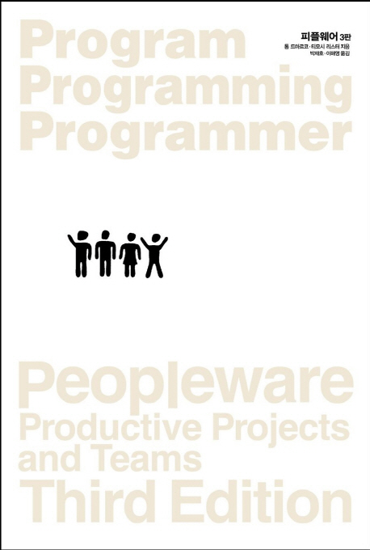

<!-- markdownlint-disable MD025 MD036 MD041 -->

# 한줄평

사람들이 모여서 만드는 것이 소프트웨어이다. 그러기에 소프트웨어라는 일에서 우리가 인간 문제와 사회학을 생각해 봐야 하는 이유다.

# 책소개

소프트웨어 조직에 대한 고전인 "피플웨어"는 톰 드마르코님과 티모시 리스터님이 쓴 책이다. 초판은 1987년에 발행되었으면 1999년,2013년에 걸쳐 3판까지 개정되어 있다. 번역은 박재호님, 이해영님이 하였다. 이번에도 `개발자 한 달에 책 한권 읽기` ([모임 링크](https://www.facebook.com/dev.reader))에서 2019년 3월에 보기로한 책이다.

# 감상평

맨먼스미신에서 자주 언급되어 꼭 읽고 싶었던 책이다. 맨먼스미신보다 더 실용적인 이야기가 많이 담겨 있다. 책을 보면서 그동안 회사조직에서 겪었던 일들과 비슷한 사례들이 많이 나와 깜짝 놀라게 된다.
책에서 나온 나쁜 사례들을 내가 대부분 겪었다는 것에 안타까움을 느끼며 이와 반대로 내가 겪었던 좋은 사례들이 책에서 성공 사례들과 연결되어 책이 너무 현실적으로 다가왔다. 책을 읽다가 예전 생각들이 나서 한참을 되뇌이게 했던 일이 "함께 자라기" 보다 더 자주 있었다. 그냥 읽히는 책보다 이렇게 내 예전 기억을 자주 떠올리며 몰입하게 해주는 책을 읽을 때는 책을 쓴 저자가 친구같다고 생각을 하게 된다.

이 책은 문제를 해결하는 방법에 대해서도 말하고 있어 귀담아 볼것이 많다. 근 10년간 일하면서 성공과 실패한 프로젝트가 존재하는데 책에서 언급한 사례와 주장들과 맞아떨어지는 부분들이라 내가 속한 곳에서만 일어나는게 아닌 라는 걸 알게되어 안도감이 들게 된다.
이전에 내가 프로젝트를 잘 이끌기 위해 하는 행동은 `동료코칭`이었다. 책에서도 잘 단결된 팀이 일하는 못습을 살펴보면 동료 코칭이라는 기본적인 일상 활동이 항상 자연스럽게 일어난다고 했다. 내 경우는 처음부터 단결된 팀은 아니였지만 동료코칭으로 팀이 단결되어 성공한 사례였다. 이외에도 중요한 인재에 대한 관리자와의 신뢰와 자율성 보장이 주요 요인이었다.

내 생각에 동료들과 같이 읽거나 관리자들이 읽고 의견을 나누었으면 하는 책이다. 서문의 옮긴이의 글에서 자신이 처한 환경이나 지위가 바뀔 때마다 이 책을 다시 읽어보라는 조언에 동의한다. 또한 아래의 옮긴이가 말한 조언을 깊이 받아들이려 한다.

> 개발자들은 이 책을 읽으며 파랑새를 뒤쫓으며 남의 회사만 부러워해서는 곤란하다. 조직, 환경, 문화가 바뀌기를 기대한다면 항상 자신부터 바뀌어야 한다. "피플웨어"에서 전사적인 조직 변화의 중요성도 언급하지만, 구체적으로 나와 내 주변에 영향을 미치는 방법을 언급하는 이유가 바로 여기에 있다. 하지만 사람이나 조직이나 변화는 쉽지 않으며, 결국 실천의 문제로 귀결된다.

# 내용 갈무리

## 1부 인적 자원 관리

* 사람과 관련된 문제를 무엇이라 칭하든, 그것들은 다음 프로젝트에서 부딪힐 어떤 설계 문제, 구현 문제, 방법론 문제보다 여러분을 곤란하게 만들 가능성이 더 크다. 그리고 바로 이 생각이 이 책 전반에 깔린 논지다.
* `우리 업무에서 주요 문제는 본질적으로 기술적인 문제가 아니라 사회학적인 문제다.`
* 잠시만 자신이 동네 패스트푸트 프랜차이즈 점장이라 상상해 보라. 효율적인 생산을 위해 다음과 같은 조치는 당연하다.
* (->아래 조치는 어디선가 많이 봐 왔던 거다)
  * 오작동을 없애라. 기계(인간 기계)를 최대한 원활하게 돌리다.
  * 매장에서 빈둥거리는 직원을 엄중히 다루라.
  * 직원을 교체 가능한 기계 부품으로 취급하라.
  * 현재 상태를 유지하라(능률을 높일 궁리는 하지 말라. 망하는 지름길이다.)
  * 절차를 표준화하라. 모든 일은 매뉴얼대로 하라.
  * 실험을 하지 말라. 본사 사람들이 할 일이다.
* 실수를 용납하지 않는 분위기가 자리 잡으면 사람들은 바로 방어적으로 변한다.
* (->이 분위기는 내 주위에 팽배하다)
* 계획을 세우고, 새로운 방법을 조사하고, 책을 읽고, 새로운 기법을 배우고, 예측하고, 일정을 세우고, 에산을 점검하고, 인력을 적절히 배치하는 일에 보내는 시간은 단지 5%에 불과하다.
* 평균적으로 일반 소프트웨어 개발자는 자신의 업무와 관련한 책을 한 권도 소유하지 않으며 읽지도 않는다. 소프트웨어 분야에서 업무 질을 걱정하는 사람에게는 끔찍한 현실이다.
* 그들이 생산성을 거론할 때마다 스페인식 경영 이론이 드러난다. 생산성이란, 원래 1시간 업무에서 얻어지는 성과를 의미하지만 이제는 1시간어치 월급으로 쥐어짜내는 노동량을 의미하게 됐다.
* 우리 모두가 한 번쯤은 일을 더 시키기 위해 팀원들에게 압력을 가하는 단기적인 책략에 굴복한 적이 있다.
* 직장에서 감정을 일으키는 주요 원인은 상처받은 자존심이다. 우리는 자신이 만드는 제품의 질과 자존심을 밀접하게 결부시키는 성향이 있다.
* 1954년 영국 작가 C. 노스코트 파킨슨은 업무는 주어진 시간만큼 늘어진다는 개념을 소개했다. 이른바 파킨슨의 법칙이라 알려진 개념이다.
* 파킨슨은 과학자가 아니었다. 파킨슨은 자료를 수집하지 않았다. 아마 파킨슨은 통계적 추론의 규칙도 몰랐을 것이다. 파킨슨은 유머작가였다. 파킨슨의 '법칙'이 유명해진 이유는 '사실'이라서가 아니라 '재미'있어서였다.
* 건강한 업무 환경에서 업무가 진전되지 않는 이유는 능력 부족, 자신감 부족, 팀원들과 연대감 부족, 프로젝트와 프로젝트 목표에 대한 공감 부족이다.
* **파킨슨 법칙의 변종**
* `회사 업무량은 업무일 수를 채우도록 늘어나는 경향이 있다`
* 이 경우 파킨슨의 법칙을 보여주는 쪽은 직원들이 아니라 회사라는 사실에 주목하라.
* 잡지 뒷면에서 잘라낸 쿠폰과 돈 수천 달러를 우편으로 보낸 후 환상적인 생산성 향상 장치를 배송받는다면 얼마나 좋을까? 물론 효과가 없을지도 모르지만 그래도 쉬운 오답이 어려운 정답보다 흔히 더 매력적이다.
* **소프트웨어 관리에서 잘못된 희망 일곱가지**
  * 내가 미처 발견하지 못했으나 생산성을 급격히 향상시킬 방법이 있다.
    * 그렇게 근본적인 뭔가를 놓쳤을 정도로 여러분은 멍청하지 않다.
  * 다른 관리자들은 2배에서 3배까지도 생산성을 높인다!
    * 무시하라.
  * 기술이 너무 빨리 발전해 따라잡기 어렵다.
    * 맞다. 기술은 매우 빠르게 발전한다. 하지만 여러분이 하는 일 대부분은 엄밀히 첨단 기술 업무가 아니다.
  * 프로그래밍 언어를 바꾸면 생산성이 크게 높아진다.
    * 프로그래밍 언어는 사람들이 문제를 생각하는 방식에 영향을 미친다는 측면에서 중요하지만, 한 번 더 강조하자면, 프로젝트에서 구현 단계에만 영향을 미친다.
  * 백로그 때문에 생산성을 당장 2배로 올려야 한다.
    * 그 말 많은 소프트웨어 백로그는 미신이다.
  * 모든 것이 자동화되었다. 이제 소프트웨어 개발 업무도 자동화할 때가 아닐까?
    * 첨단 기술 환상의 한 형태다.
  * 팀원들은 압박하면 일을 더 잘 한다.
    * 아니다. 일을 덜 즐긴다.
* **이것이 관리다**
* 관리자의 역할은 사람들을 일하게 만드느 것이 아니라 사람들이 일할 수 있게 만들어주는 것이라는 사실 말이다.