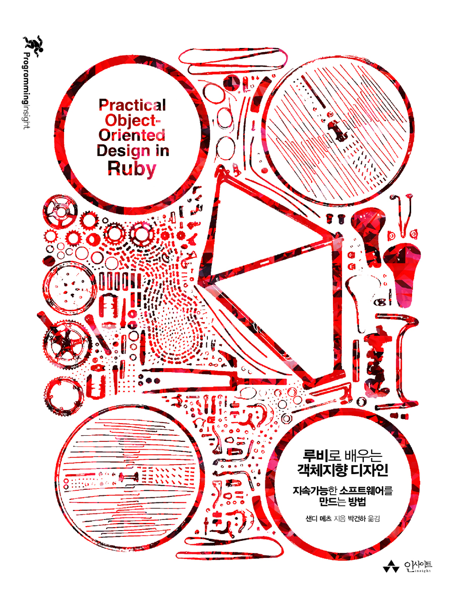

<!-- markdownlint-disable MD025 MD036 MD041 -->

# 한줄평

객체지향 설계 디자이너를 위한 실용서.

# 책소개

`루비로 배우는 객체지향 디자인` 이 책의 부제는 지속가능한 소프트웨어를 만드는 방법이다. 원제는 번역된 문구와 비슷하지만 부제는 다르다. 원제는 `Practical Object-Oriented Design in Ruby`이고 부제는 `AN AGILE PRIMER`이다. 원제를 직역하면 "루비로 된 실용적인 객체지향 디자인: 애자일 초보"로 할 수 있는데 지속가능한 소프트웨어를 만드는 방법이 원제 보다 번역한 제목이 내용과 잘 어울린다고 생각한다.

2013년도에 원서가 출판되었고 번역서는 1년 뒤인 2014년도에 출판되었다. 저자는 샌디 메츠(Sandi Metz)님이다. 저자의 홈페이지([샌디메츠 홈페이지](https://www.sandimetz.com/about))에 보면 직업을 선생님, 작가, 컨설턴트로 소개하는데 직업들을 보니 저자가 설명을 잘하는게 수긍이 된다. 번역도 잘되어 매끄럽게 읽히는 것 같다. 번역은 박건한님이다.

# 감상평

책 제목만 보고 루비를 모르면 이해하기 힘들겠다고 생각했는데 충분히 이해할 수 있게 구성되어 있다. 직설적으로 말하는 글이라 읽기가 편하다. 또한 책의 내용 구성도 문제에 부딪히고 그걸 해결해 가는 과정을 보여줌으로서 주제를 이해하는데 큰 도움이 된다. 하나 더 좋았던 점은 문제나 해결방안을 바라보는 사고과정이나 생각들이 자주 나오는데 이렇게 속으로 고민하는 점들이 실제 내가 고민할 것 같은 고민처럼 느껴져 쉽게 몰입하게 해준다.

> 디자인은 나중에 디자인할 수 있는 여지를 남겨 놓기 위한 것이고, 그 최종 목표는 변화의 비용을 최소화하는 것이다.

이 주장이 저자가 핵심적으로 하고 싶은 말이라고 볼 수 있다. 그리고 읽다 보면 저자가 이 내용을 자주 언급해서 자연스럽게 이게 저자가 하고 싶은 말이었다는 걸 알게 된다.

객체지향을 고민하는 사람이거나 입문하는 사람에게 적극 추천한다. 그리고 이 책과 더불어 `객체지향의 사실과 오해`를 읽는다면 이 책에서 말하는 `메시지`, `역할`, `책임`의 이해를 넓힐 수 있다고 생각한다. 특히 이 책은 코드 사례를 효과적으로 활용하면서 설명하기 때문에 실제 코딩할 때도 도움이 많이 될 것 같다.
